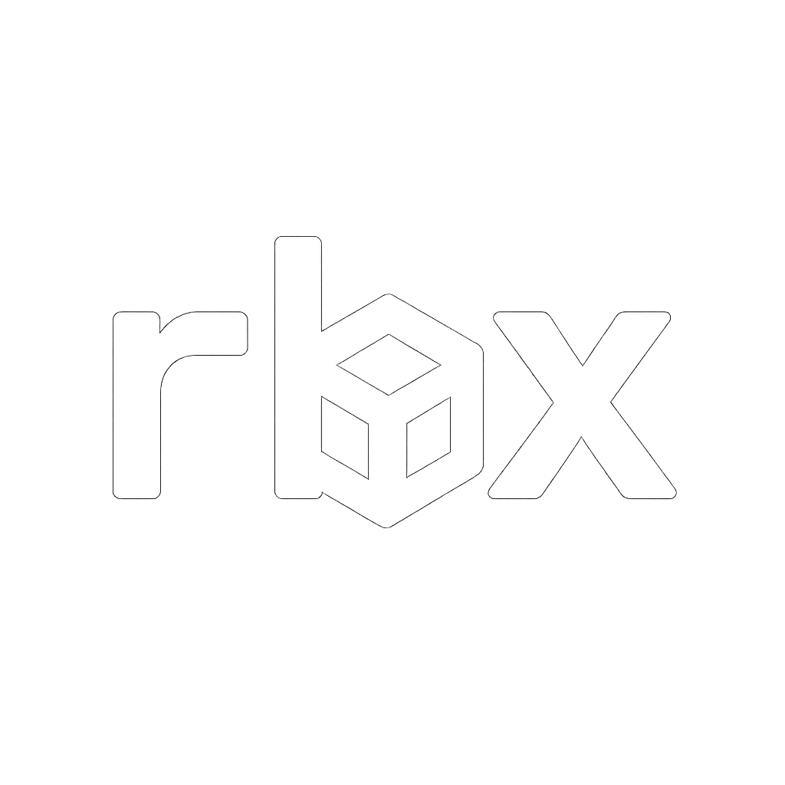

	

    <em>The go-to CLI tool for programming competitions setters.</em>

	<!-- loscal repository, no metadata badges. -->

	
	
	
	

 <!-- TABLE OF CONTENTS -->

  
Table of Contents
 

- [Overview](#overview)
- [Features](#features)
- [Documentation](#documentation)
- [License](#license)

##  Overview

<!--[![Usage video]](https://github.com/rsalesc/rbx/assets/4999965/111de01e-6cbd-495e-b8c2-4293921e49b3)-->

**rbx** is a CLI tool that empowers setters from the competitive programming community.

A flexible setting tool, as powerful as [Polygon](https://polygon.codeforces.com/), right on your terminal.

--- 

## Features

- 🧱 Structure: describe your problem or contest structure with the use of YAML configuration files.
- 🤖 Generation: provides a simple way to describe your whole testset, including both manually added and generated testcases.
- 🔨 Testing: provides commands for automatically running correct and incorrect solutions against the testcases of your problem, automatically judging whether the verdict was as expected or not.
- ✅ Verify: checks if your testcases and solutions are strictly conformant with the use of validators and unit tests.
- 📝 Statements: provides tooling for writing and building statements, also ensuring they're easily synchronized with your testset.
- 📤 Package: provides a single command for packaging your problems for use in your preferred judge system.

---

##  Documentation

You can read the docs [here](https://rsalesc.github.io/rbx/).

---

##  License

This project is protected under the [Apache License 2.0](http://www.apache.org/licenses/) License. For more details, refer to the [LICENSE](LICENSE) file.

---

[**Return**](#-overview)

---
