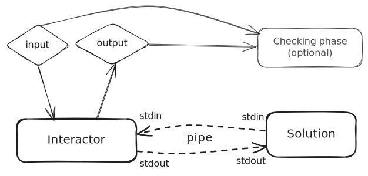
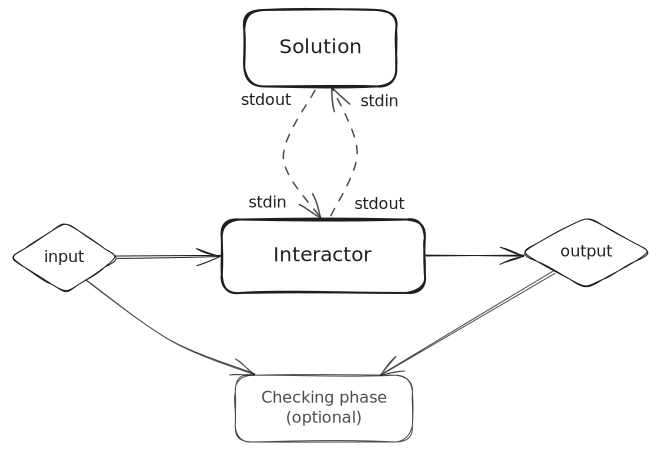

# Interactors

Interactor is a concept introduced by {{testlib}} to play the role of an agent that
communicates with the participant's solution through the pair `stdin`/`stdout` in
interactive problems.

You can read more about what is an interactive problem in this thorough [Codeforces blog post](https://codeforces.com/blog/entry/45307) written by Mike Mirzayanov.

In this section, we will see how to write an interactive problem and how to define an interactor for it in {{rbx}}.

## Motivational problem

Let's assume we have a problem that asks you to find a number between 1 and `N`, where `N` is between 2 and 1000.
You should find it with at most 10 guesses to the interactor. A guess is a line in the format `? X`, where `X` is a number between 1 and `N`.

The interactor will first give you the value of `N`, and then respond each guess with `<`, `>` or `=` if the guess is less than, greater than or equal to the secret number, respectively. When responding with `=`, the game ends and the solution should finish execution.

Let's assume the secret number is 7. A possible interaction between the solution and the interactor is the following:

| Agent       | Line  | Description                      |
| ----------- | ----- | -------------------------------- |
| Interactor  | `10`  | Tells participant that `N = 10`  |
| Participant | `? 5` | The participant guesses 5        |
| Interactor  | `<`   | 5 is less than the secret number |
| Participant | `? 7` | The participant guesses 7        |
| Interactor  | `=`   | 7 is equal to the secret number  |
| -           |       | Both agents finish execution     |

## Preliminary definitions

Let's first of all define an interactor for the problem. In most cases, the interactor should be the very first
component to be written in an interactive problem, because it is particularly hard to write solutions and test them
before having one defined.

!!! tip
    Of course, you can always interactively run your solution.

    Feel free to use the `rbx compile <solution>` command to compile them, and run them by
    executing `build/exe` from your project's root directory.

    In this case, you will interactively write to the solution's `stdin`, essentially playing the role of the interactor.

A {{testlib}} interactor consists of an executable that receives two arguments:

```bash
./interactor <input_file> <output_file>
```

Besides these two files, the interactor also communicates with the solution through the `stdin`/`stdout` files.

The interactor:

- Receives the test input from the `input_file` (the participant can't see this file);
- Writes some logging output to the `output_file` (the participant can't see this file);
- Reads the participant's output from `stdin`;
- Writes the participant's input into `stdout`.

This structure is depicted in the following diagram:

<center markdown>

</center>

Thus, even though the communication between the two agents is done through `stdin`/`stdout`, the interactor
still has its own input and output files that can have a similar purpose to the inputs and outputs of an usual
batch problem.

For this problem, let's assume we have a testset containing some input files containing two numbers: `N` and
the secret number `S`, with `1 <= S <= N <= 1000`. We can also assume we've written a validator for this file.

!!! note

    Notice *validators* will receive the input file the interactor reads from, not the `stdin` of the participant's solution.

## The interactor

*You can read more about {{testlib}} interactors in the [official testlib documentation](https://codeforces.com/blog/entry/18455).*

Now that we have our input formally defined, let's write a {{testlib}} interactor and set it up in our problem.

You can see in the commented code below how to read from each of the files available to the interactor.

=== "interactor.cpp"

    ```cpp linenums="1"
    #include "testlib.h"
    #include "rbx.h"

    using namespace std;

    // Testlib interactors have a non-conventional stream setup:
    // - inf: for reading the input file
    // - ouf: for reading the participant's output
    // And two C++ IO streams for writing:
    // - cout: for writing to the participant's input
    // - tout: for writing the output file
    int main(int argc, char *argv[]) {
        registerInteraction(argc, argv);

        int N = inf.readInt(); // (1)!
        int S = inf.readInt();

        int MAX_Q = getVar<int>("Q.max"); // (2)!

        for(int i = 0; i < MAX_Q; i++) {
          int X = ouf.readInt(1, N); // (3)!

          if(X < S) { // (4)!
            cout << "<" << endl;
          } else if(X > S) {
            cout << ">" << endl;
          } else {
            cout << "=" << endl;
            tout << i+1 << endl; // (5)!
            quitf(_ok, "found the secret number in %d guesses", i + 1);
          }
        }

        quitf(_wa, "exceeded the maximum number of guesses");
    }
    ```

    1.  Reads the two input numbers from the input file.

        This was either provided by a generator or manually by you.

    2.  Reads the maximum number of guesses allowed from the {{rbx}} variables.

        We defined this would be 10 in the statement above, but let's define this as a variable
        as a good practice.

    3.  Reads the participant's guess from the `stdin` of the interactor / `stdout` of the solution.
  
        Notice we also check it is within bounds.

    4.  Writes back the response to the guess to the `stdout` of the interactor / `stdin` of the solution.

        We use the common C++ `std::cout` stream for that.

    5.  In case the solution is correct, writes the number of guesses to the output file for logging purposes (in some judging systems, you can inspect this file, for instance).

        We use the C++ `tout` stream for that.

=== "problem.rbx.yml"

    ```yaml
    # ... rest of the problem.rbx.yml ...
    # We have to set these for the problem to be considered interactive
    type: COMMUNICATION
    interactor:
      path: 'interactor.cpp'
    # ...
    vars:
      Q:
        max: 10
    ```

## Executing solutions against the interactor

Solutions for interactive problems can be executed normally, similar to batch problems, with the `rbx run`
and `rbx irun` commands.

Read more about them in the [Running solutions](/setters/running/) section.

!!! warning

    When providing a custom input for `rbx irun`, you're actually providing the input to the interactor,
    **NOT** the solution.

The results of the run can also be inspected using the `rbx ui` command.

{{ asciinema("wJnaQpSpYNRty3UPCwNlc90JV") }}

If you want to compile the solution, and interactively communicate with it as if you were the interactor agent,
you can compile your solution with the `rbx compile` command and then run it manually with `./build/exe`.

```bash
rbx compile solution.cpp
./build/exe
# ... start interacting with the solution as the interactor ...
```

## Do I need to write a checker?

Short answer: no, you don't need to write a checker. In fact, the {{icpcformat}} doesn't support one.

Instead, this format expects the interactor to both communicate with the solution and judge it. Other
judging systems do support specifying a checker, and some even require one (e.g., {{polygon}}).
However, this practice is not encouraged by {{rbx}}, as it is not part of the {{icpcformat}}.

!!! tip

    {{rbx}} will automatically generate a dummy/no-op checker when you generate a package for a judging
    system that requires one. You should not worry about this!

{{rbx}} does give you the flexibility to specify a checker by setting an extra bit in the `problem.rbx.yml` file. This is put
there as a guard so you don't mistakenly set a checker for your interactive problem without realizing it.

```yaml title="problem.rbx.yml" hl_lines="5"
# ...
type: COMMUNICATION
interactor:
  path: 'interactor.cpp'
  legacy: true
checker:
  path: 'checker.cpp'
```

The newly defined checker will read as the outputs for the participant's and the jury's solutions the `output_files`
produced by their interactor runs (whatever was written into `tout`).

<center markdown>

</center>

Then, you could split the previously defined interactor into two files as such:

=== "interactor.cpp"

    ```cpp linenums="1"
    #include "testlib.h"

    using namespace std;

    int main(int argc, char *argv[]) {
        registerInteraction(argc, argv);

        int N = inf.readInt();
        int S = inf.readInt();

        while (true) {
          int X = ouf.readInt(1, N);

          if(X < S) {
            cout << "<" << endl;
          } else if(X > S) {
            cout << ">" << endl;
          } else {
            cout << "=" << endl;
            tout << i+1 << endl;
          }
        }

        quitf(_ok, "ok"); // leave the query limit to the checker
    }
    ```

=== "checker.cpp"

    ```cpp linenums="1"
    #include "testlib.h"
    #include "rbx.h"

    using namespace std;

    int main(int argc, char *argv[]) {
        registerTestlibCmd(argc, argv);

        int N = inf.readInt();
        int S = inf.readInt();

        int MAX_Q = getVar<int>("Q.max");

        int p_guesses = ouf.readInt();

        if (p_guesses > MAX_Q) {
            quitf(_wa, "participant exceeded the maximum number of guesses (%d > %d)", p_guesses, MAX_Q);
        }

        quitf(_ok, "found the secret number in %d guesses", p_guesses);
    }
    ```

!!! danger "Incompatible with ICPC"

    This is not part of the {{icpcformat}}, and thus {{rbx}} will throw an error if you try to
    generate an ICPC package for an interactive problem that has a checker.

    The solution will be to migrate the checker into the interactor.