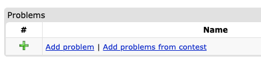
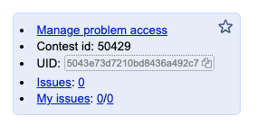
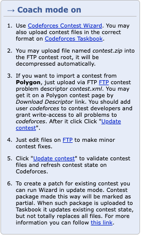

# Packaging: Polygon

{{rbx}} provides a command to build packages for Polygon. The Polygon format supports
two types of packages: problem packages and contest packages.

## Problem packages

Problem packages are built by running the following command:

```bash
rbx package polygon
```

You can also specify the main language of the problem (in case you have multiple statements) using the `-l` or `--language` flag:

```bash
rbx package polygon -l en
```

Or, if you want to build a problem package for each problem in your contest:

```bash
rbx contest each package polygon
```

## Contest packages

There's also a contest-level command for building a contest package:

```bash
rbx contest package polygon
```

This command will build a single `.zip` file with all problems in the contest.

## Uploading to Codeforces Gym

There are two totally different ways of uploading Polygon packages to Codeforces Gym.

### Using the Polygon API

You can also upload your problem packages to Polygon, gather them into a Polygon contest, and import them in the Gym.

This is a process that is a bit more complicated, and has a few limitations, but that usually gives you a better result.
The pros of using this method are:

- You'll get a Polygon problem instance for each problem in your contest. This means you can access the problem in Polygon,
  run some custom invocations, and even tune the time limit of each problem to Codeforces' machines.
- You can get HTML statements which render natively in Codeforces.
- Does not depend on the flaky Taskbook FTP.

Follow the step-by-step guide below to get your contest up in the Gym.

#### Step 1: Get a Polygon API key

Log in to Polygon and go to the *Settings* page. In the *API Keys* section, create a new API key
and save the generated pair.

#### Step 2: Upload all your problems to Polygon using the API

You can upload all problems to the contest by defining the environment variables below
and running the {{rbx}} command:

```bash
export POLYGON_API_KEY=<your-api-key>
export POLYGON_API_SECRET=<your-api-secret>
rbx contest each package polygon -u
```

You can also use the `--upload-as-english` flag to force the main statement to be uploaded as the English statement in Polygon, regardless of its actual language. This is useful because Codeforces uses a different -- not so good -- LaTeX renderer for statements in languages other than English.
Thus, it's often useful to use the English renderer regardless of the actual statement language.

```bash
rbx contest each package polygon -u --upload-as-english
```

#### Step 3: (Optional) Tune your time limits and statements to Polygon

This is the optional part that we **highly recommend** following. There are two components in Polygon
that might not work right out of the box when you upload your problem, and it's worth checking them
and tuning them if necessary.

1. **Time limits**: The time limits might not work well in the Polygon machines. We recommend you to
   fire up a custom invocation in the *Invocations* section, and tune your time limit based on that
   in the *General info* section.

2. **Statements**: Polygon only supports rendering in HTML a [subset](https://polygon.codeforces.com/docs/statements-tex-manual) of *LaTeX* commands. You might have to do some manual adjustments if you really want HTML statements in your contest. With some trial and error, it is easy to get a sense of which commands work and which don't.

#### Step 4: Create a new Polygon contest with all the problems

Now that you have all your problems in Polygon, you can create a new contest and import all problems into it.

Click *New contest* in the top-right corner, and fill in the form. Then, enter the contest and add all problems
you uploaded to it. Finally, click *Manage problem access* and give `read` access to `codeforces` to all problems, and
to the contest itself.

After that, click *Build standard packages* to ensure the packages for all problems are built.

#### Step 5: Create a contest in the Gym and import the Polygon contest

Enable coach mode, create a new contest and hit the *Add problems from contest* link.



In the following page, paste the contest UID in Polygon, and click the button. You can obtain the contest UID like in the picture below:



#### Iterating on the Polygon problem

You can always follow step (2) again in to update the problem in Polygon after doing modifications to it. Sometimes, though, this process is too slow, and you might want to use
faster methods.

##### Partial Uploads

If you want to upload only specific parts of the problem (e.g. only statements, or only source files), you can use the `--upload-only` flag. Conversely, if you want to skip certain parts, you can use `--upload-skip` (or `--dont-upload` internally, but exposed as skip).

Supported values are: `statements`, `solutions`, `tests`, `files`.

```bash
# Upload only statements and files (checker/interactor/validator/headers)
rbx contest each package polygon -u --upload-only statements --upload-only files

# Upload everything EXCEPT tests
rbx contest each package polygon -u --upload-skip tests
```

Feel free to keep those variables in your `.bashrc` (or equivalent in other shells) file if you want.

This will create a Polygon problem for each problem in your contest following the pattern `<contest-name>-<problem-shortname>-<problem-name>` (example: `my-contest-a-my-problem` for a contest named `my-contest` with a problem named `my-problem` which has the letter `A`).

This problem will contain the validator, checker, interactor, and any other files you added to the problem. The time and memory limits will also be synced with Polygon, but often it's a good idea to tune them manually in the Polygon interface.

The statement blocks will also be uploaded to Polygon, along with all model solutions. Solutions that are no longer present in the package will be removed from Polygon (marked as deleted).

Testcases are also uploaded. If your package uses generators, the generators are uploaded and the script is updated in Polygon to generate the tests. Manual tests (without generators) are uploaded as files.


### Using the Taskbook FTP (flaky)

You can upload a contest package to Codeforces Gym by first building it with the command above, and then
using the Codeforces Taskbook FTP (taskbook.codeforces.com) to upload your zip file to your contest.

You can read more about the Taskbook by enabling coach mode, creating a new contest in the Gym, and looking
at the "Coach mode on" section on the right side of the contest page. It will look like the image below:



Follow the instructions to upload your contest ZIP.

!!! note
    By uploading through the Taskbook, you'll only get PDF statements. That is not a limitation of {{rbx}},
    but rather the way Codeforces Gym and Taskbook work (probably for safety reasons as otherwise people could
    inject arbitrary HTML code into Codeforces).

    If you prefer HTML statements, you can use the option [above](#using-the-polygon-api).

!!! danger
    Quite often the Taskbook FTP will be down. It seems this endpoint is not very reliable anymore.
    Refer to the option below, which is a bit more complicated but more reliable.

#### Caveats

!!! warning
    The caveats in this section are probably the main reason you should consider using {{polygon}} directly
    if your main goal is to hold a Gym contest.

The Polygon API has a few limitations. The main two, which have huge implications on how {{rbx}} uploads your problems, are:

- The API doesn't allow you to remove solutions from a problem;
- The API doesn't allow you to remove manual tests from a problem.

This means that, whenever you remove a few manual tests from a problem, or a solution, and re-upload, you have to manually
get rid of them. {{rbx}} will successfully replace every test index that still exists, and also the solutions that exist,
but it won't do anything to remove old ones.

Instead, {{rbx}} will just mark the removed solutions as deleted and ensure they're not run, but
they'll still show in Polygon.

Also notice that whenever you tune your time limits or statements in Polygon and re-issue an upload, those modifications
you did will be overridden. You have to be extra careful with that. Preferrably, you should replicate all your statement
changes in {{rbx}} before uploading to Polygon.


