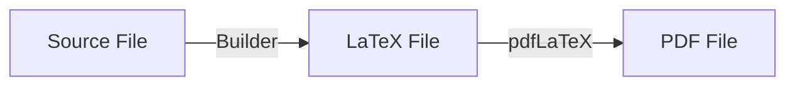

# Statements

The **statement** is the document that describes the problem to the contestant. It typically contains the problem description, input format, output format, constraints, and samples.

{{rbx}} supports a powerful and flexible statement system that allows you to write statements in multiple formats, including the custom {{rbxtex}} format, as well as standard LaTeX and PDF.

## Overview

Regardless of the format you choose, every statement goes through a build pipeline to generally produce a PDF file (though you can also export the intermediate LaTeX if needed).



### Supported formats

{{rbx}} supports multiple formats for writing statements. We **highly recommend** using {{rbxtex}} for most problems, as it offers the best balance between power and ease of use.

| Format                             | Description                                                                           | Best for...                                                     |
| :--------------------------------- | :------------------------------------------------------------------------------------ | :-------------------------------------------------------------- |
| **{{rbxtex}}**                     | **Recommended**. A superset of LaTeX with block structure and variable interpolation. | Most problems. It separates content from layout effectively.    |
| [**JinjaTeX**](formats/latex.md)   | Pure LaTeX with Jinja2 templating.                                                    | Import existing statements, but still leverage from templating. |
| [**Pure LaTeX**](formats/latex.md) | Standard static LaTeX files.                                                          | Importing existing statements without modifications.            |
| [**PDF**](formats/pdf.md)          | Pre-built PDF files.                                                                  | Using statements that are already built/provided as PDFs.       |

## Configuration

Statements are configured in the `problem.rbx.yml` file under the `statements` list. You can define multiple statements for the same problem (e.g., different languages, different versions).

```yaml title="problem.rbx.yml"
statements:
  - name: statement-en        # (1)!
    language: en              # (2)!
    path: statement.en.tex    # (3)!
    type: rbx-tex             # (4)!
    assets:                   # (5)!
      - images/*.png
    vars:                     # (6)!
      editorial: false
      showLimits: true
```

1.  **name**: A unique identifier for the statement. Used to refer to this statement.
2.  **language**: The language code (ISO 639-1) for the statement.
3.  **path**: Path to the statement file, relative to the package root.
4.  **type**: The format of the statement. Can be `rbx-tex`, `jinja-tex`, `tex`, or `pdf`.
5.  **assets**: A list of files (globs supported) to be included in the build directory.
6.  **vars**: Custom variables to be injected into the statement.

## Assets and resources

You can include images, style files, and other resources in your statement using the `assets` field. These files will be copied to the build directory alongside your statement file, preserving their relative paths.

```yaml
statements:
  - name: statement-en
    path: statements/en.tex
    assets:
      - statements/images/*.png
      - statements/icpc.sty
```

In the case above, the statement source file `en.tex` will be placed in `<build-dir>/en.tex` while building,
while an image such as `statements/images/example.png` will be placed in `<build-dir>/images/example.png`. In other words, the path of the asset relative to the statement source file is preserved in the build directory.

!!! tip
    Keep your statement files and assets organized in a subdirectory (e.g., `statements/` or `doc/`) to avoid cluttering the package root.

## Building statements

To build statements, use the `rbx statements build` command (or alias `rbx st b`):

```bash
# Build all statements
rbx statements build

# Build specific statements by name
rbx statements build statement-en

# Build for specific languages
rbx statements build --languages en pt
```

The built statements will be placed in the `build/` directory of your package.
