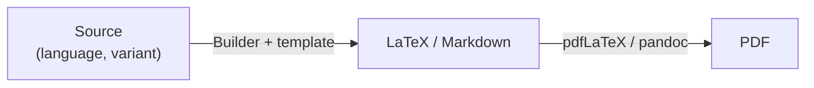

# Statements

A **statement** is the document a contestant reads: the story, the input and
output format, the constraints, the samples. In {{rbx}} it is part of the
package, declared in `problem.rbx.yml` next to the solutions and the testset,
and built into a PDF by a command.

Think of the last contest you prepared without a tool like this. You lowered
`N` from $10^9$ to $10^5$ two days before the contest, changed the validator,
changed the generators, and forgot the statement. Or you had an English and a
Portuguese version, and fixed a typo in one of them. Or you spent the last night
pasting eight problems into a single `.tex` by hand, and the samples went stale
the moment someone regenerated the tests.

{{rbx}} takes those three jobs off your hands. Constraints come from the same
`vars` your validator reads, so the bounds cannot disagree. Samples are pulled
from the testset every time you build. And the contest book is assembled from
the problems themselves, in as many languages as you declare.

In the sections below, we'll build the mental model first, then walk through the
commands, and finish with the flags you'll reach for once the basics are in
place.

## Building your first statement

Let's start from the smallest thing that works. A statement entry needs a
language and a file:

```yaml title="problem.rbx.yml"
statements:
  - language: en
    file: statements/statement.rbx.tex
```

And the file itself holds the content, in named **blocks**:

```latex title="statements/statement.rbx.tex"
%- block legend
Given two integers $A$ and $B$, compute $A + B$.
%- endblock

%- block input
A single line with two integers $A$ and $B$.
%- endblock

%- block output
A single line with the sum of $A$ and $B$.
%- endblock
```

Notice there is no `\documentclass` in there, and no section titles. The blocks
carry *what the problem says*; a template decides *how it looks*, and the
template is not your problem's business. Build it:

<!--termynal-->
```bash
$ rbx statements build   # alias: rbx st b
```

{{ asciinema("statement-build") }}

The PDF lands in `build/statement-en.pdf`. The recording above runs the command
from inside problem `A` of a contest, which is why it builds two languages and
picks up the contest's own layout; we get to [contest
statements](contest.md) further down.

!!! tip
    Keep the sources and their images in a subdirectory such as `statements/`,
    so they don't clutter the package root.

## What a statement is

Under the hood, a statement is a `(language, variant)` source of some `type`,
rendered to a PDF. Four fields carry all of it:

- **`language`** is an ISO 639-1 code (`en`, `pt`, ...). You declare **one entry
  per `(language, variant)` pair**.
- **`variant`** is an optional label that defaults to `default`. It lets you keep
  more than one recipe for the same language, and we come back to it
  [below](#keeping-two-recipes-for-one-language).
- **`type`** is the source format. It defaults to `rbx-tex`, so most of the time
  you leave it out.
- **`file`** is the source file, relative to the package root.

Everything else is optional.

!!! info
    See the [package schema](../reference/package/schema.md) for the exhaustive
    field list. This guide covers what you reach for; the schema covers
    everything.

## Where statements are declared

Problem statements live in `problem.rbx.yml`, keyed only by `(language,
variant)`:

```yaml title="problem.rbx.yml"
statements:
  - language: en
    file: statements/statement-en.rbx.tex # (1)!
  - language: pt
    file: statements/statement-pt.rbx.tex
```

1.  The source file, relative to the package root. `type` defaults to `rbx-tex`
    and `variant` defaults to `default`, so both are omitted. Problem statements
    have **no `name`**.

That is the whole problem side: point at a file, name a language.

Contest statements live in `contest.rbx.yml` instead. They carry everything a
problem statement does, plus the templates that wrap each problem into the book,
because the contest owns the chrome:

```yaml title="contest.rbx.yml"
statements:
  - name: main-en # (1)!
    language: en
    file: statements/contest-en.rbx.tex # (2)!
    standaloneProblemTemplate: statements/problem-standalone.rbx.tex # (3)!
    contestProblemTemplate: statements/problem-in-contest.rbx.tex # (4)!
```

1.  Contest statements and documents **require** a `name`. It identifies the
    entry and keys the output PDF.
2.  The joining document, which is the contest book itself.
3.  Full-document template used to render each problem on its own (`rbx st b`).
4.  Fragment template used when problems are joined into the book
    (`rbx contest st b`).

Those two templates are where contest statements get interesting, and
[Contest statements](contest.md) walks through both of them.

## The three kinds

A contest build stitches every problem's statement into one booklet: a cover,
then problem A, then B, and so on. That stitching is the **join**. Some kinds of
statement take part in it and one does not.

The one that does not is a **document**: a contest-only page that stands on its
own and never pulls in a problem's statement. It is how you make the extra pages
a contest needs but a single problem cannot produce, such as an infosheet with
every problem's limits, or a cover page. A **tutorial**, meanwhile, is an
editorial: the write-up explaining how to *solve* a problem rather than how to
read it.

Each of the three is its own list:

| Kind         | Where             | Joined into the contest? | Purpose                       |
| ------------ | ----------------- | ------------------------ | ----------------------------- |
| `statements` | problem + contest | yes                      | the problem/contest statement |
| `tutorials`  | problem + contest | yes                      | editorials                    |
| `documents`  | contest only      | no                       | infosheets, cover pages       |

Notice that `statements` and `tutorials` are the same thing under the hood. Same
source model, same build pipeline. They live in different lists and produce
differently named PDFs, and that is the extent of it.

## Formats at a glance

You pick one `type` per statement, and the choice matters: only the `rbx-*`
types carry blocks and can **join** into a contest book. The rest are simpler
passthroughs.

| `type`      | When to use                                      | Joins? |
| ----------- | ------------------------------------------------ | ------ |
| `rbx-tex`   | **Default.** {{latex}} with blocks + {{Jinja2}}. | yes    |
| `rbx-md`    | Markdown with blocks + {{Jinja2}}.               | yes    |
| `jinja-tex` | {{latex}} with {{Jinja2}} only, no blocks.       | no     |
| `jinja-md`  | Markdown with {{Jinja2}} only.                   | no     |
| `tex`       | Plain {{latex}}, passed through untouched.       | no     |
| `md`        | Plain Markdown, passed through untouched.        | no     |
| `pdf`       | A pre-built PDF, copied through as-is.           | no     |

[Writing in a format other than rbxTeX](writing.md#writing-in-a-format-other-than-rbxtex)
covers when each one earns its place.

!!! note
    `type` is case- and hyphen-insensitive, and you can omit it entirely for the
    default `rbx-tex`. One caveat: `documents` may only use `jinja-tex`,
    `jinja-md`, `tex`, `md` or `pdf`, never the joining `rbx-*` types.

## Building

Each list has its own builder, and every command ships with a short alias:

<!--termynal-->
```bash
# Build problem statements (one PDF per language).
$ rbx statements build          # alias: rbx st b

# Build the contest book and its documents.
$ rbx contest statements build  # alias: rbx contest st b

# Build tutorials (editorials).
$ rbx tutorials build           # alias: rbx tut b
```

Built PDFs land in the `build/` directory:

- **Standalone**: `build/statement-<lang>[-<variant>][-<profile>].pdf`, and
  tutorials use `build/tutorial-…`.
- **Contest**: `build/<statement-name>[-<profile>].pdf`, keyed by the contest
  statement's `name`, **not** by its language.

## The pipeline

Whatever the format, every statement flows through the same pipeline on its way
to a PDF, and you can stop at the intermediate {{latex}} if that is all you
need:


```mermaid
graph LR
    Source["Source<br/>(language, variant)"] -->|Builder + template| TeX["LaTeX / Markdown"]
    TeX -->|pdfLaTeX / pandoc| PDF["PDF"]
```

!!! note "The contest owns the chrome"
    The template that wraps a problem into a full document lives on the
    **contest** statement, not on the problem. Run `rbx st b` with no contest,
    or with no matching standalone template, and {{rbx}} falls back to a bundled
    default template and **warns**. It will not fail on you. See
    [Contest statements](contest.md) for the details.

## Building only some languages

Once a problem has three or four languages, rebuilding all of them to proofread
one gets slow. `--languages` restricts the build, and it is repeatable:

```bash
# Build only the English statement.
rbx st b --languages en

# Build English and Portuguese, skipping the rest.
rbx st b --languages en --languages pt
```

The flag works the same way on `rbx contest st b` and `rbx tut b`.

## Rendering against a timing profile

The time limit printed in a statement is whichever limit the package carries. If
you package the same problem for two judges with different limits, you want each
PDF to say the right number. The `-p` / `--profile` flag renders the statement
against a saved [limits profile](../profiling/index.md#limits-profiles):

```bash
rbx st b -p icpc
```

The profile name is appended to the output filename, so
`build/statement-en-icpc.pdf` sits next to `build/statement-en.pdf` instead of
overwriting it. See [Profiling](../profiling/index.md) for how profiles are
estimated and saved.

!!! warning
    The profile must exist in the problem. On a contest build, problems missing
    the profile are skipped with a warning rather than silently rendered against
    the package limits.

## Keeping two recipes for one language

`variant` is the second half of a statement's identity, and it defaults to
`default`. Declare a second entry with the same `language` and a different
`variant` when you want two renderings of the same problem in the same language:
a full version and a short one for the onsite booklet, say.

```yaml title="problem.rbx.yml"
statements:
  - language: en
    file: statements/statement-en.rbx.tex
  - language: en
    variant: short # (1)!
    file: statements/statement-en-short.rbx.tex
```

1.  `(en, default)` and `(en, short)` are two distinct statements. Declaring the
    same pair twice is an error.

Build one variant by naming it positionally:

```bash
rbx st b short
```

The variant also lands in the filename, so the two entries above build to
`build/statement-en.pdf` and `build/statement-en-short.pdf`. On the contest side
the variant is half of the [join key](contest.md#the-language-variant-join), so a
contest statement declared as `(en, short)` joins each problem's `short` variant.

## When a statement fails to build

Statements are built **independently of each other**. If your problem has an
English and a Portuguese statement and the English one fails, the Portuguese one
is still built. The command lists everything that failed at the end and exits
non-zero. One broken language never blocks the others.

Inside a *contest* build the rule tightens, deliberately: a problem that cannot
be rendered fails the whole statement rather than quietly dropping out of the
book. See [When a problem cannot be
rendered](contest.md#when-a-problem-cannot-be-rendered) for that story, and for
the `--partial` escape hatch.

## Where to go next

From here, pick the guide that matches what you are doing:

- **[Writing statements](writing.md)** for the source side: blocks, variables,
  samples and images.
- **[Template context](context.md)** for the values in scope while rendering.
- **[Contest statements](contest.md)** for the two problem templates, the join
  and the `documents`.
- **[Tutorials](tutorials.md)** for editorials, which are the same model in a
  separate list.
