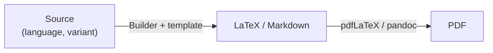

# Statements

A **statement** is the document that describes a problem — or a whole contest —
to the contestant. {{rbx}} builds statements from source files into a PDF, with
first-class support for the {{rbxtex}} format, and it handles plain {{latex}},
Markdown, and pre-built PDFs just as well.

You write the problem once and get a PDF out of it, in as many languages and
variants as you need. This page is the map — we'll build the
mental model first (what a statement is, the kinds you can declare, where they
live, and how they're built), then hand you off to the focused guides for
writing, templating, contests, and tutorials.

## What a statement is

At its core, a statement is a `(language, variant)` source of some `type`,
rendered to a PDF:

- **`language`** — an ISO 639-1 code (`en`, `pt`, ...). You declare **one entry
  per `(language, variant)` pair**.
- **`variant`** — an optional label (defaults to `default`) that lets you keep
  more than one recipe for the same language — say, a full version and a
  simplified one.
- **`type`** — the source format. It defaults to `rbx-tex`, so most of the time
  you just leave it out.
- **`file`** — the source file, relative to the package root.

Everything else — the title, custom `params`, assets, sample selection — is
optional.

!!! info
    See the [auto-generated reference](../reference/package/schema.md) for the
    exhaustive field list.

## The three kinds

Statements come in three flavors, and each flavor is its own list:

| Kind         | Where             | Joins problems?   | Purpose                       |
| ------------ | ----------------- | ----------------- | ----------------------------- |
| `statements` | problem + contest | yes (in contests) | the problem/contest statement |
| `tutorials`  | problem + contest | yes (in contests) | editorials                    |
| `documents`  | contest only      | no                | infosheets, cover pages       |

Notice that `statements` and `tutorials` are really the same thing under the
hood — same source model, same build pipeline — they just live in different
lists and produce differently named PDFs. `documents` are the odd ones out:
contest-only standalone pages that never pull in any problem content.

## Where they're declared

Problem statements live in `problem.rbx.yml`, keyed only by `(language,
variant)`:

```yaml title="problem.rbx.yml"
statements:
  - language: en
    file: statements/statement-en.rbx.tex # (1)!
```

1.  The source file, relative to the package root. `type` defaults to `rbx-tex`
    and `variant` defaults to `default`, so both are omitted here. Problem
    statements have **no `name`**.

That's all there is to the problem side — point at a file, name a language,
and you're done.

Contest statements live in `contest.rbx.yml` instead. They carry everything a
problem statement does, plus the templates that wrap each problem into the book —
because the contest **owns the chrome**:

```yaml title="contest.rbx.yml"
statements:
  - name: main-en # (1)!
    language: en
    file: statements/contest-en.rbx.tex # (2)!
    standaloneProblemTemplate: statements/problem-standalone.rbx.tex # (3)!
    contestProblemTemplate: statements/problem-in-contest.rbx.tex # (4)!
```

1.  Contest statements and documents **require** a `name` — it identifies the
    entry and keys the output PDF.
2.  The joining document — the contest book itself.
3.  Full-document template used to render each problem on its own (`rbx st b`).
4.  Fragment template used when problems are joined into the contest book
    (`rbx contest st b`).

Those two templates are where contest statements get interesting — we walk
through them in full in [Contest statements](contest.md).

!!! tip
    Keep your statement sources and their assets in a subdirectory (e.g.
    `statements/`) so they don't clutter the package root.

## Formats at a glance

You pick one `type` per statement, and the choice matters: only the `rbx-*`
types carry blocks and can **join** into a contest book — the rest are simpler
passthroughs. Every row below links into the [Writing statements](writing.md)
guide:

| `type`                    | When to use                                      | Joins? |
| ------------------------- | ------------------------------------------------ | ------ |
| [`rbx-tex`](writing.md)   | **Default.** {{latex}} with blocks + {{Jinja2}}. | yes    |
| [`rbx-md`](writing.md)    | Markdown with blocks + {{Jinja2}}.               | yes    |
| [`jinja-tex`](writing.md) | {{latex}} with {{Jinja2}} only (no blocks).      | no     |
| [`jinja-md`](writing.md)  | Markdown with {{Jinja2}} only.                   | no     |
| [`tex`](writing.md)       | Plain {{latex}}, passed through untouched.       | no     |
| [`md`](writing.md)        | Plain Markdown, passed through untouched.        | no     |
| [`pdf`](writing.md)       | A pre-built PDF, copied through as-is.           | no     |

!!! note
    `type` is case- and hyphen-insensitive, and you can omit it entirely for the
    default `rbx-tex`. One caveat: `documents` may only use `jinja-tex`,
    `jinja-md`, `tex`, `md`, or `pdf` — never the joining `rbx-*` types.

## Building

Each list has its own builder, and every command ships with a short alias.
Below, the ones you'll reach for:

<!--termynal-->
```bash
# Build problem statements (one PDF per language)
$ rbx statements build          # alias: rbx st b

# Build one variant positionally, by its `variant`
# (mirror of `rbx contest st b <name>`)
$ rbx st b short

# Build the contest book and its documents
$ rbx contest statements build  # alias: rbx contest st b

# Build tutorials (editorials)
$ rbx tutorials build           # alias: rbx tut b

# Restrict to one or more languages (repeatable)
$ rbx st b --languages en --languages pt

# Render against a timing profile
$ rbx st b -p icpc
```

See [Profiling time limits](../profiling/index.md) for how the `-p` profiles work.

Built PDFs land in the `build/` directory:

- **Standalone** — `build/statement-<lang>[-<variant>][-<profile>].pdf`
  (tutorials use `build/tutorial-…`).
- **Contest** — `build/<statement-name>[-<profile>].pdf`, keyed by the contest
  statement's `name`, **not** its language.

## Pipeline

No matter the format, every statement flows through the same pipeline on its way
to a PDF — and you can stop at the intermediate {{latex}} if that's all you need:


```mermaid
graph LR
    Source["Source<br/>(language, variant)"] -->|Builder + template| TeX["LaTeX / Markdown"]
    TeX -->|pdfLaTeX / pandoc| PDF["PDF"]
```

!!! note "The contest owns the chrome"
    The template that wraps a problem into a full document lives on the
    **contest** statement, not the problem. Run `rbx st b` with no contest (or
    without a matching standalone template) and {{rbx}} falls back to a bundled
    default template and **warns** — it won't fail on you. See
    [Contest statements](contest.md) for the details.

## Where to go next

That's the whole picture. From here, pick the guide that matches what you're
doing:

- **[Writing statements](writing.md)** — author your source content,
  {{rbxtex}}-first: blocks, variables, samples, and assets.
- **[Template context](context.md)** — the variables in scope while rendering
  (`params` vs `vars`, the `problem`/`contest` namespaces, per-sample handles).
- **[Contest statements](contest.md)** — the two problem templates, the
  `(language, variant)` join, and `documents`.
- **[Tutorials](tutorials.md)** — editorials: the same model, just a separate
  list.
