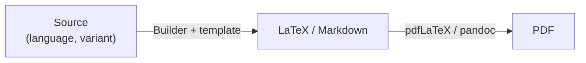

# Statements

A **statement** is the document a contestant reads, with the story, the input
and output format, the constraints and the samples. In {{rbx}} it's part of the
package, declared in `problem.rbx.yml` next to the solutions and the testset,
and built into a PDF by a command.

Think of the last contest you prepared without a tool like this. You lowered
`N` from $10^9$ to $10^5$ two days before the contest, changed the validator,
changed the generators, and forgot the statement. Or the English PDF said 2
seconds and the Portuguese one still said 1. Or you spent the last night
pasting eight problems into one `.tex` by hand, and the samples went stale
the moment someone regenerated the tests.

{{rbx}} takes those three jobs off your hands. Constraints come from the same
`vars` your validator reads, so the bounds cannot disagree. Samples are pulled
from the testset every time you build. And the contest book is assembled from
the problems themselves, in as many languages as you declare.

In the sections below, we'll build a first statement, then cover the model behind
it and the build commands, and finish with the flags you'll need once the basics
work.

## Building your first statement

Let's start from the smallest thing that works. A statement entry needs a
language and a file:

```yaml title="problem.rbx.yml"
statements:
  - language: en
    file: statements/statement.rbx.tex
```

The file has the content, split into named **blocks**:

```latex title="statements/statement.rbx.tex"
%- block legend
Given two integers $A$ and $B$, compute $A + B$.
%- endblock

%- block input
A single line with two integers $A$ and $B$.
%- endblock

%- block output
A single line with the sum of $A$ and $B$.
%- endblock
```

Notice there is no `\documentclass` in there, and no section titles. The blocks
hold *what the problem says*, and a template decides *how it looks*. The
template is not your problem's business. Build it:

<!--termynal-->
```bash
$ rbx statements build   # alias: rbx st b
```

{{ asciinema("statement-build") }}

{{rbx}} writes the PDF to `build/statement-en.pdf`. The recording above runs the command
from inside problem `A` of a contest, which is why it builds two languages and
picks up the contest's own layout. [Contest statements](contest.md) covers
that.

!!! tip
    Keep the sources and their images in a subdirectory such as `statements/`,
    so they don't clutter the package root.

## Declaring a statement

A statement is a `(language, variant)` source of some `type`, rendered to a
PDF. These fields define it:

- **`language`** is an ISO 639-1 code (`en`, `pt`, ...) that defaults to `en`.
  You declare **one entry per `(language, variant)` pair**.
- **`variant`** is an optional label that defaults to `default`. It lets you keep
  more than one recipe for the same language, and we come back to it
  [below](#keeping-two-recipes-for-one-language).
- **`type`** is the source format. It defaults to `rbx-tex`, so most of the time
  you leave it out.
- **`file`** is the source file, relative to the package root.

Everything else is optional.

!!! info
    See the [package schema](../reference/package/schema.md) for the exhaustive
    field list. This guide covers the fields you use most often.

Problem statements live in `problem.rbx.yml`, keyed only by `(language,
variant)`, and have **no `name`**. The entry in [Building your first
statement](#building-your-first-statement) is already complete: it omits
`type` and `variant` and takes their defaults. That's all a problem needs: a
file per entry, plus a language when it isn't English.

Contest statements live in `contest.rbx.yml` instead. They have every field a
problem statement has, plus the templates that wrap each problem into the book.
That's because the contest defines the **chrome**: the document setup, styling
and cover pages around the problems. Here's a contest statement that declares
both templates:

```yaml title="contest.rbx.yml"
statements:
  - name: main-en # (1)!
    language: en
    file: statements/contest-en.rbx.tex # (2)!
    standaloneProblemTemplate: statements/problem-standalone.rbx.tex # (3)!
    contestProblemTemplate: statements/problem-in-contest.rbx.tex # (4)!
```

1.  Every contest entry (statements, tutorials and documents) **requires** a
    `name`. It identifies the entry and keys the output PDF.
2.  The joining document, which is the contest book itself.
3.  Full-document template used to render each problem on its own (`rbx st b`).
4.  Fragment template used when problems are joined into the book
    (`rbx contest st b`).

!!! note "Building without a contest template"
    Run `rbx st b` with no contest, or with no matching standalone template, and
    {{rbx}} falls back to a bundled default template and **warns**. It won't fail
    on you.

[Contest statements](contest.md) explains both templates in detail.

## Statements, tutorials and documents

A contest build stitches every problem's statement into one booklet: a cover,
then problem A, then B, and so on. That stitching is the **join**. Some kinds of
statement take part in it and one does not.

The one that doesn't is a **document**, a contest-only page that never pulls
in a problem's statement. Use documents for pages that belong to the contest as
a whole, like a cover page or an infosheet with every problem's limits. A
**tutorial** is an editorial, the write-up that explains how to *solve* a
problem.

Each of the three is its own list:

| Kind         | Where             | Joined into the contest? | Purpose                       |
| ------------ | ----------------- | ------------------------ | ----------------------------- |
| `statements` | problem + contest | yes                      | the problem/contest statement |
| `tutorials`  | problem + contest | yes                      | editorials                    |
| `documents`  | contest only      | no                       | infosheets, cover pages       |

Notice that `statements` and `tutorials` work the same way. They share the
source model and the build pipeline, and only differ in which list they're
declared in and how their PDFs are named.

## Formats at a glance

You pick one `type` per statement. Only the `rbx-*` types have blocks and can
**join** into a contest book. The rest are simpler passthroughs.

| `type`      | When to use                                      | Joins? |
| ----------- | ------------------------------------------------ | ------ |
| `rbx-tex`   | **Default.** {{latex}} with blocks + {{Jinja2}}. | yes    |
| `rbx-md`    | Markdown with blocks + {{Jinja2}}.               | yes    |
| `jinja-tex` | {{latex}} with {{Jinja2}}, no blocks. Jinja runs only in contest-level entries (documents, or a contest statement of this type). | no |
| `jinja-md`  | Markdown with {{Jinja2}} only. Jinja runs only in contest-level entries (documents, or a contest statement of this type). | no |
| `tex`       | Plain {{latex}}, passed through untouched.       | no     |
| `md`        | Plain Markdown, passed through untouched.        | no     |
| `pdf`       | A pre-built PDF, copied through as-is.           | no     |

[Writing in a format other than rbxTeX](writing.md#writing-in-a-format-other-than-rbxtex)
covers when to use each one.

!!! note
    `type` is case- and hyphen-insensitive, and you can omit it entirely for the
    default `rbx-tex`. One caveat: `documents` may only use `jinja-tex`,
    `jinja-md`, `tex`, `md` or `pdf`, never the joining `rbx-*` types.

## Building

Each list has its own builder, and every command ships with a short alias:

<!--termynal-->
```bash
# Build problem statements (one PDF per language).
$ rbx statements build          # alias: rbx st b

# Build the contest book and its documents.
$ rbx contest statements build  # alias: rbx contest st b

# Build tutorials (editorials).
$ rbx tutorials build           # alias: rbx tut b
```

Built PDFs go to the `build/` directory:

- **Standalone**: `build/statement-<lang>[-<variant>][-<profile>].pdf`, and
  tutorials use `build/tutorial-…`.
- **Contest**: `build/<statement-name>[-<profile>].pdf`, keyed by the contest
  statement's `name`, **not** by its language.

Every statement goes through the same pipeline, whatever its format:


```mermaid
graph LR
    Source["Source<br/>(language, variant)"] -->|Builder + template| TeX["LaTeX / Markdown"]
    TeX -->|pdfLaTeX / pandoc| PDF["PDF"]
```

To stop at the generated `.tex`, pass `--output tex` to `rbx st b`.

## Building only some languages

Once a problem has three or four languages, rebuilding all of them to proofread
one gets slow. `--languages` restricts the build, and it is repeatable:

```bash
# Build only the English statement.
rbx st b --languages en

# Build English and Portuguese, skipping the rest.
rbx st b --languages en --languages pt
```

The flag works the same way on `rbx contest st b` and `rbx tut b`.

## Rendering against a timing profile

The time limit printed in a statement is the one set in the package. If
you package the same problem for two judges with different limits, you want each
PDF to say the right number. The `-p` / `--profile` flag renders the statement
against a saved [limits profile](../profiling/profiles.md):

```bash
rbx st b -p icpc
```

The profile name is appended to the output filename, so
`build/statement-en-icpc.pdf` sits next to `build/statement-en.pdf` instead of
overwriting it. See [Profiling](../profiling/profiles.md) for how profiles are
estimated and saved.

!!! warning
    The profile must exist in the problem. On a contest build, problems missing
    the profile are skipped with a warning rather than silently rendered against
    the package limits.

## Keeping two recipes for one language

`variant` is the second half of a statement's identity, and it defaults to
`default`. Declare a second entry with the same `language` and a different
`variant` when you want two renderings of the same problem in the same language:
a full version and a short one for the onsite booklet, say.

```yaml title="problem.rbx.yml"
statements:
  - language: en
    file: statements/statement-en.rbx.tex
  - language: en
    variant: short # (1)!
    file: statements/statement-en-short.rbx.tex
```

1.  `(en, default)` and `(en, short)` are two distinct statements. Declaring the
    same pair twice is an error.

Build one variant by naming it positionally:

```bash
rbx st b short
```

The variant also goes into the filename, so the entries above build to
`build/statement-en.pdf` and `build/statement-en-short.pdf`. On the contest side
the variant is half of the [join key](contest.md#the-language-variant-join), so a
contest statement declared as `(en, short)` joins each problem's `short` variant.

## When a statement fails to build

Statements are built **independently of each other**. If your problem has an
English and a Portuguese statement and the English one fails, the Portuguese one
is still built. The command lists everything that failed at the end and exits
non-zero. One broken language never blocks the others.

The exception is the samples. They're built once, before any statement, and if
that fails the command stops without building any of them.

Inside a *contest* build the rule tightens, deliberately: a problem that cannot
be rendered fails the whole statement rather than quietly dropping out of the
book. See [When a problem cannot be
rendered](contest.md#when-a-problem-cannot-be-rendered) for that story, and for
the `--partial` escape hatch.

## Where to go next

From here, pick the guide that matches what you are doing.

<div class="grid cards" markdown>

-   :fontawesome-solid-pen: **Write your statement**

    ---

    The source side, {{rbxtex}}-first: blocks, constraints pulled from `vars`,
    sample explanations and images.

    [:octicons-arrow-right-24: Writing statements](/setters/statements/writing)

-   :fontawesome-solid-code: **Look up what's in scope**

    ---

    Every value a statement or a template can use: the `params`, `vars`,
    `problem` and `contest` namespaces, the per-sample handles and the filters.

    [:octicons-arrow-right-24: Template context](/setters/statements/context)

-   :fontawesome-solid-file-pdf: **Build the contest book**

    ---

    The two problem templates, the `(language, variant)` join, and the cover
    pages and infosheets that never join a problem.

    [:octicons-arrow-right-24: Contest statements](/setters/statements/contest)

-   :fontawesome-solid-lightbulb: **Write the editorial**

    ---

    Tutorials are the same model in a separate list, built to their own PDFs.

    [:octicons-arrow-right-24: Tutorials](/setters/statements/tutorials)

</div>
