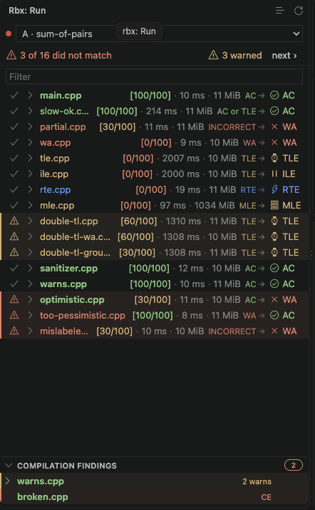
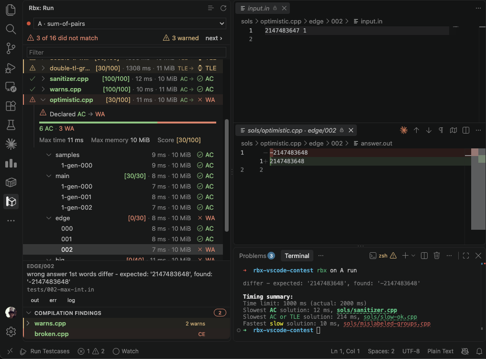
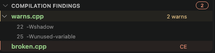
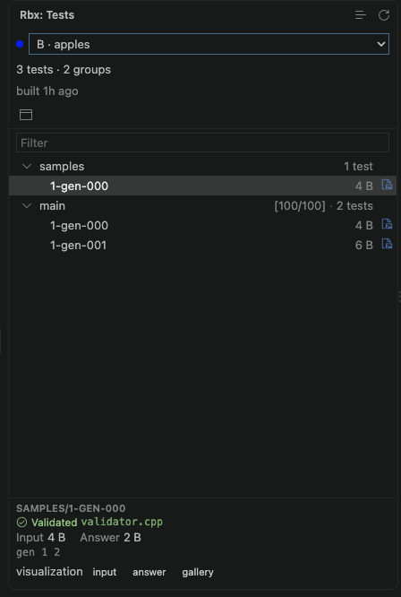
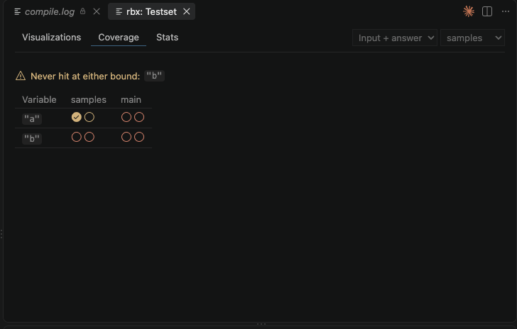
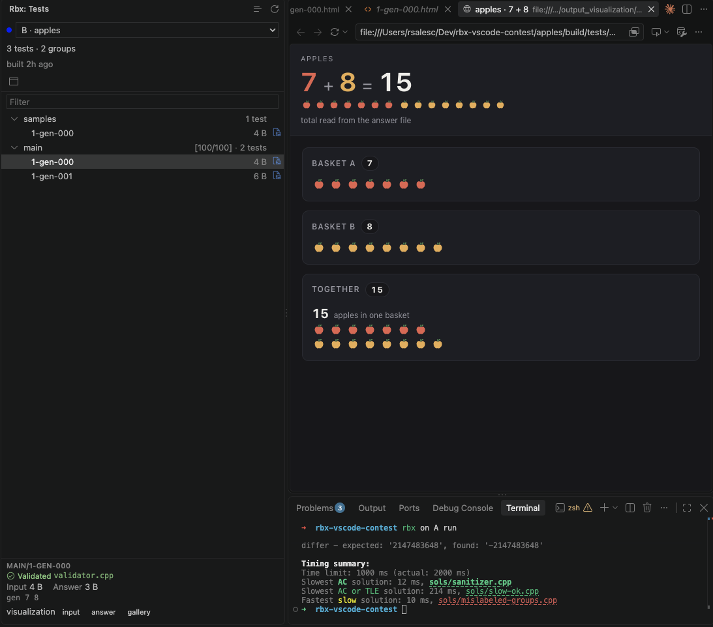

# rbx for VS Code

`rbx ui` is one way to inspect a run and the testset it ran against. The rbx
extension is another, for when the editor is where you already are: it reads
the same files from the same package, and shows them in the sidebar next to the
solution you are editing.

Which one you want is mostly a matter of where you work. The TUI runs anywhere
a terminal does, and does not care which editor you use; the extension gives
you VS Code's own diff, its editors and its Problems panel, and it does not
take over the terminal you are typing `rbx` into.

!!! note "It never runs rbx for you"
    Execution stays in the terminal. You type `rbx run`; the extension watches
    the package and renders whatever lands there.

## Installing

From the editor's integrated terminal:

```bash
rbx vscode install
```

That sideloads the `.vsix` bundled with your {{rbx}}, so the extension always
matches the CLI that produced the runs it reads. **Reload the window
afterwards** -- a freshly installed extension does not activate in windows that
are already open.

Cursor, Windsurf and VSCodium work the same way: they all report themselves as
VS Code, and {{rbx}} tells them apart by which app the terminal belongs to. Pass
`--editor` if it guesses wrong, which is also how you install from a terminal
outside the editor.

```bash
rbx vscode install --editor cursor
```

Over SSH or in a devcontainer this installs into the *remote* extension host,
which is the right place -- that is where your package lives.

The extension is not published on any marketplace. When your {{rbx}} ships a
newer extension than the one you have installed, `rbx run` says so once and
points you back at this command.

## The run view

The **rbx** icon in the activity bar opens the run view: solution, group,
testcase, filled in live as `rbx run` works through them.



Three different things can be true of a solution at once, and the view keeps
them in three separate places so they cannot be mistaken for one another:

| Channel | Says |
|---|---|
| the **name**, coloured | what `problem.rbx.yml` *declared* -- exactly as `rbx run` colours the same name |
| the **chip** on the right | what the run actually *produced*, one icon per verdict |
| the **gutter** on the left | whether those two agree: a tick when the declaration was met, a red triangle when it was missed, a yellow one when {{rbx}} warned about a run that still passed |

So `sols/wa.cpp` answering wrongly is a calm row, and the main solution breaking
is not -- a miss is the only thing in the view with a background colour.

Every solution and every group carries its own summary: the verdict underneath
it, the points it earned, and the **max** time and memory across its testcases.
A solution still running shows how far it has got (`12/40`) instead of a
verdict.

In a contest, a dropdown in the header picks which problem you are looking at,
naming problems by their contest letter and colour. It follows the problem that
is *running*, so `rbx contest each run` walks the view along with it. The
dropdown is hidden entirely when the workspace holds a single package.

## Opening a testcase

<kbd>Enter</kbd> on a testcase -- or a click on it -- opens **two editor
panes**: the input, and the output diffed against the expected answer.



Under the tree, a card describes the selected testcase and carries the two facts
its row cannot fit:

- **the checker's own message**, wrapped and whole -- the answer to *why* a
  solution answered wrongly;
- **where the test came from** -- the generator call, the generator script, or
  the testcase it was copied from, with the ones that point at a real file
  opening it.

The card's `out`, `err` and `log` buttons pick what the second pane shows: the
output against the expected answer, what the solution wrote to stderr, or the
run log for that testcase. The choice is sticky, so arrowing down a group keeps
reading the same channel.

The panes are laid out once, the first time a testcase is opened, and then left
alone; afterwards the extension finds its own panes and reuses whichever groups
they are sitting in. Drag them where you want them and they stay there.

## Compilation findings

A solution that did not compile never ran, and {{rbx}} leaves it out of the run
entirely. Under the tree, a **Compilation Findings** panel keeps one row per
solution the compile phase had something to say about, badged red the moment one
failed to compile and yellow while everything merely warned.



A row with warnings expands into one line per warning -- its line and its flag,
`22 · -Wshadow` -- and clicking one goes to that line in the source. A row that
failed to compile opens the compiler output verbatim.

## Browsing the testset

The **Tests** view lists what `rbx build` produced: the groups, their testcases,
and where each one came from. Selecting a testcase opens its input and expected
answer, and its card names the validator that accepted it and the generator that
wrote it.



A panel opens beside it, following whatever the sidebar has selected, with:

- a **visualization gallery**, when your package declares a visualizer;
- **constraint coverage** -- which of your validator's bounds the testset
  actually hit, and which no test ever touched;
- **testset stats** -- sizes and counts, group by group.



### Visualizations

If your package declares a [visualizer](../setters/testset/visualizers.md), the
pictures `rbx build --visualize` produced are opened from here, the way
<kbd>v</kbd> opens them in `rbx ui`. Select a testcase and its card offers one
**visualization** button per picture that exists: `input` for the testcase
itself, `answer` for the one drawn
[from the expected
answer](../setters/testset/visualizers.md#input-vs-solution-visualizers), and
`gallery` for the whole group at once, in the panel.



An image opens in an editor tab; an interactive HTML one opens in VS Code's own
browser, beside the list you picked it from, rather than in whatever program
your desktop associates with the file.

!!! warning "Solution outputs are not visualized here"
    These are the pictures {{rbx}} draws from a testcase and its expected
    answer. Visualizing what a *solution* printed is not available in the
    extension yet -- use `rbx ui` for that.

## Settings

Every surface above can be turned off or adjusted on its own. Search for
`@ext:rsalesc.rbx-vscode` in VS Code's settings to see all of them, these included.

| Setting | Default | Does |
|---|---|---|
| `rbx.compilationDiagnostics` | `true` | Report compiler warnings and failures in the Problems panel |
| `rbx.solutionLabel` | `trimmed` | How much of a solution's path the run view shows: `full`, `trimmed` or `basename` |
| `rbx.testcaseLayout` | `below` | Where the second testcase pane is *first* placed: `below` or `beside` |
