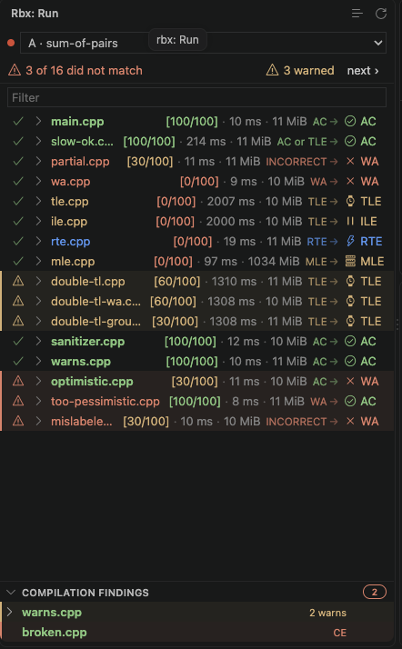
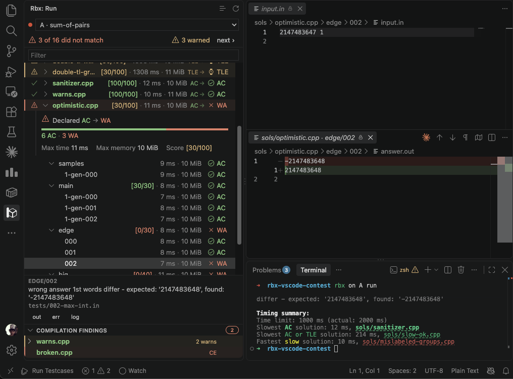
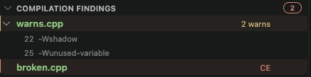
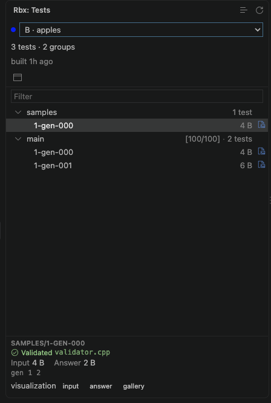
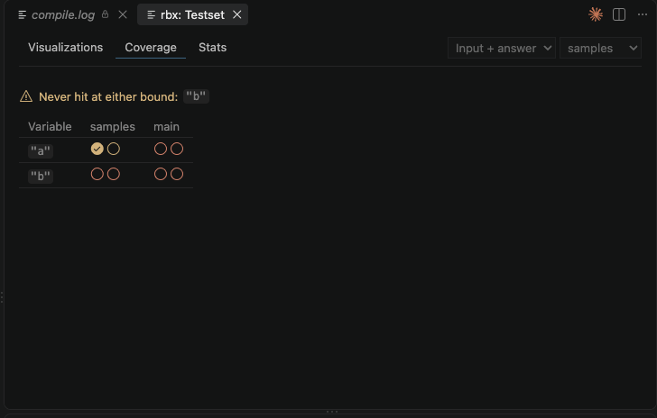
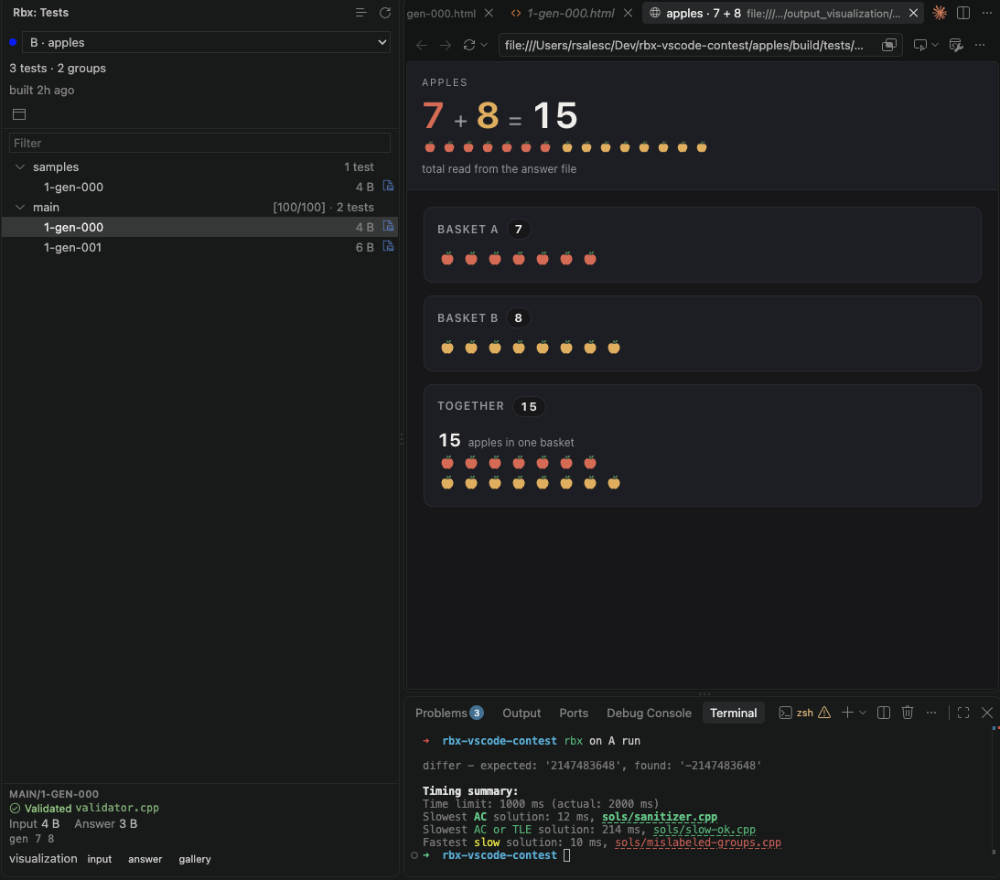

# rbx for VS Code

`rbx ui` is one way to inspect a run and the testset it ran against. The {{rbx}}
extension is another, for when the editor is where you already are: it reads
the same files from the same package, and shows them in the sidebar next to the
solution you are editing.

Which one you want depends on where you work. The TUI runs in any terminal,
whatever editor you use. The extension shows results in VS Code's own diff
view, editors and Problems panel, and leaves your terminal free for typing `rbx`.

!!! note "It never builds or runs for you"
    Execution stays in the terminal. You type `rbx run`; the extension watches
    the package and shows the results as {{rbx}} writes them. It does call {{rbx}} itself
    for a couple of small things (drawing a visualization, asking what a
    variable expands to), and for those it has to find an `rbx` to call, which
    [Finding `rbx`](#finding-rbx) covers.

## Installing

From the editor's integrated terminal:

```bash
rbx vscode install
```

That sideloads the `.vsix` bundled with your {{rbx}}, so the extension always
matches the CLI that produced the runs it reads. **Reload the window
afterwards**: a freshly installed extension doesn't activate in windows that
are already open.

Cursor, Windsurf and VSCodium work the same way: they all identify as
VS Code, and {{rbx}} tells them apart by which app the terminal belongs to. Pass
`--editor` if it guesses wrong, which is also how you install from a terminal
outside the editor. Either way, the editor's command-line launcher (`code`,
`cursor`, ...) must be on your `PATH`; if it isn't, {{rbx}} tells you how to add it.

```bash
rbx vscode install --editor cursor
```

Over SSH or in a devcontainer this installs into the *remote* extension host,
which is the right place, since your package is on the remote machine.

The extension is not published on any marketplace. When your {{rbx}} ships a
newer extension than the one you have installed, `rbx run` and `rbx ui` print a
one-line reminder that points you back at this command.

## The run view

The **rbx** icon in the activity bar opens the run view: solution, group,
testcase, filled in live as `rbx run` works through them.



The view shows what a solution was declared to do, what it did, and whether
the two agree, each in its own place so you can't mix them up:

| Channel | Says |
|---|---|
| the **name**, colored | what `problem.rbx.yml` *declared*, exactly as `rbx run` colors the same name |
| the **chip** on the right | what the run actually *produced*, one icon per verdict |
| the **gutter** on the left | whether those two agree: a tick when the declaration was met, a red triangle when it was missed, a yellow one when {{rbx}} warned about a run that still passed |

So `sols/wa.cpp` answering wrongly is a calm row, and the main solution breaking
is not: a miss is the only thing in the view with a background color.

Every solution and every group has its own summary line, with its verdict,
its points, and the **max** time and memory across its testcases.
A solution still running shows how far it has got (`12/40`) instead of a
verdict.

In a contest, a dropdown in the header picks which problem you are looking at,
naming problems by their contest letter and color. It follows the problem that
is *running*, so `rbx contest each run` walks the view along with it. The
dropdown is hidden when the workspace has only one package.

A contest split into variants gets one block per variant, headed by the variant
id. The extension doesn't know which variant you passed to `-C`, so it lists
all of them: the canonical contest's problems first, then each variant's
under its own heading. If two divisions both start at `A`, the heading tells
you which `A` you are about to open.

## Opening a testcase

<kbd>Enter</kbd> on a testcase, or a click on it, opens **two editor
panes**: the input, and the output diffed against the expected answer.



Under the tree, a card describes the selected testcase with two details that
don't fit in its row:

- **the checker's own message**, wrapped and whole -- the answer to *why* a
  solution answered wrongly;
- **where the test came from** -- the generator call, the generator script, or
  the testcase it was copied from, with the ones that point at a real file
  opening it.

The card's `out`, `err` and `log` buttons pick what the second pane shows: the
output against the expected answer, what the solution wrote to stderr, or the
run log for that testcase. The choice is sticky, so arrowing down a group keeps
reading the same channel.

The panes are laid out once, the first time a testcase is opened, and then left
alone; afterwards the extension finds its own panes and reuses whichever groups
they are sitting in. Drag them where you want them and they stay there.

## Compilation findings

A solution that did not compile never ran, and {{rbx}} leaves it out of the run
entirely. Under the tree, a **Compilation Findings** panel keeps one row per
solution the compile phase had something to say about, badged red the moment one
failed to compile and yellow while everything merely warned.



A row with warnings expands into one line per warning, showing its line and its
flag (`22 · -Wshadow`), and clicking one goes to that line in the source. A row
that failed to compile opens the compiler output verbatim.

The same findings also appear in VS Code's Problems panel: a warning on each line
the compiler warned about, and an error on any solution that failed to compile.
`rbx.compilationDiagnostics` turns that off.

## Browsing the testset

The **Tests** view lists what `rbx build` produced: the groups, their testcases,
and where each one came from. Selecting a testcase opens its input and expected
answer, and its card shows the validator that accepted it and the generator that
wrote it.



A panel opens beside it, following whatever the sidebar has selected, with:

- a **visualization gallery**, when your package declares a visualizer;
- **constraint coverage** -- which of your validator's bounds the testset
  actually hit, and which no test ever touched;
- **testset stats** -- sizes and counts, group by group.



### Visualizations

If your package declares a [visualizer](../setters/testset/visualizers.md), the
pictures `rbx build --visualize` produced are opened from here, the way
<kbd>v</kbd> opens them in `rbx ui`. Select a testcase and its card offers one
**visualization** button per picture that exists: `input` for the testcase
itself, `answer` for the one drawn
[from the expected
answer](../setters/testset/visualizers.md#input-vs-solution-visualizers), and
`gallery` for the whole group at once, in the panel.



An image opens in an editor tab; an interactive HTML one opens in VS Code's own
browser, beside the list you picked it from, rather than in whatever program
your desktop associates with the file.

!!! warning "Solution outputs are not visualized here"
    These are the pictures {{rbx}} draws from a testcase and its expected
    answer. Visualizing what a *solution* printed is not available in the
    extension yet -- use `rbx ui` for that.

## Variables in a statement

When you edit a statement, every `\VAR{...}` that refers to one of the
package's [variables](../setters/variables.md) is followed by the value it
expands to. You can read the numbers in a constraints block without opening
`problem.rbx.yml` beside it.

```{.latex .no-copy}
\item $1 \le N \le \VAR{N.max}$    100000
\item $1 \le a_i \le \VAR{A.max}$  1000000000
```

The grayed numbers on the right are VS Code **inlay hints**, drawn by the
editor rather than written to the file: `editor.inlayHints.enabled` turns them
off along with every other extension's hints, and `rbx.statementVarHints` turns
off only these.

The values come from `rbx vars`, which only reads `problem.rbx.yml` -- so they
are right while you type, and do not wait for a `rbx build` or a
`rbx statements build`.

A reference piped through a
[filter](../setters/statements/context.md#filters) is hinted as what the filter
makes of it, not as the bare number underneath. {{rbx}} renders the expression
itself, and the hint matches the statement whatever you pipe through --
`sci`, `rsci`, or any {{Jinja2}} builtin such as `upper` or `round(2)`:

```{.latex .no-copy}
\item $1 \le N \le \VAR{N.max | sci}$      10⁵
\item $1 \le a_i \le \VAR{A.max | sci}$    10⁹
\item Answers modulo \VAR{MOD | rsci}      10⁹ + 7
```

An inlay hint can't typeset math, so it spells the same value in plain text:
superscript digits and `×` where the built statement gets `^{}` and `\times`.
Only the spelling changes. A filter makes the same choice in both places: if
`sci` leaves `250000` as plain digits in the PDF, the hint shows plain digits
too.

A reference to a
[test group's own variables](../setters/statements/context.md#building-a-subtasks-table-from-testgroup-vars)
is hinted too, as long as it spells out the group's name:

```{.latex .no-copy}
\item In subtask 1, $N \le \VAR{problem.groups.sub1.vars.N.max}$    10
```

The value is that group's *resolved* set (the package variables with the
group's overrides applied), so a name the group does not override is hinted
with the value it inherits, exactly as it renders. The shorthand
`\VAR{problem.groups.sub1.N.max}` is hinted the same way. For a group whose
name contains a dash, use the bracket syntax {{Jinja2}} requires:
`\VAR{problem.groups['sub-1'].N.max}`.

A hint is shown only where it can be exactly right, which leaves out some
references on purpose:

- **Only a group you name.** A reference like `\VAR{g.N.max}` inside a
  `\BLOCK{for g in groups}` loop renders a different number per group, so it
  gets nothing. A subtasks table is usually written with that loop, so the
  table isn't hinted, while a constraint that spells out its group is.
- **Only a plain reference to a variable that exists.** A misspelled name, a
  commented-out line or a half-typed pipeline like `\VAR{N.max |}` gets
  nothing. An absent hint is never a wrong one, and it is a useful
  tell: a misspelled variable is the one reference on the line with no number
  next to it.
- **Only what the manifest calls a statement.** `problem.rbx.yml`'s
  `statements` and `tutorials` are hinted; a contest statement declared in
  `contest.rbx.yml` isn't.

## Seeing what a solution is declared to do

Outside the run view, the extension also shows what `problem.rbx.yml` declares
about the file you're looking at:

- In the Explorer and on editor tabs, each declared file gets a badge: solutions
  show their expected outcome, and everything else shows its role (generator,
  validator, checker and so on).
- A solution's editor shows its expected outcome on a CodeLens above its first
  line, and again in the language status area of the status bar, which stays
  visible while you scroll.

## Finding `rbx`

Drawing a visualization and reading a statement's variables both call {{rbx}},
so the extension has to find one. It tries `PATH` first and then asks a login
shell, because the extension host inherits the `PATH` of whatever launched VS
Code. Open the editor from Finder or the Dock rather than from a terminal and
that `PATH` is a bare one, without the `~/.local/bin` that `uv tool install`
and `pipx` write into.

If neither finds it, point `rbx.executable` at the binary. The setting is
per-folder: in a workspace with packages on different {{rbx}} versions, each
folder can point at its own.

Everything else keeps working without an `rbx` to call: the views read files.

## Settings

Search for `@ext:rsalesc.rbx-vscode` in VS Code's settings to see every setting.
The ones below adjust features on this page.

| Setting | Default | Does |
|---|---|---|
| `rbx.decorateExplorer` | `true` | Badge declared files in the Explorer and on editor tabs |
| `rbx.solutionCodeLens` | `true` | Show a solution's expected outcome on a CodeLens above its first line |
| `rbx.solutionStatus` | `true` | Show a solution's expected outcome in the language status area |
| `rbx.compilationDiagnostics` | `true` | Report compiler warnings and failures in the Problems panel |
| `rbx.statementVarHints` | `true` | Show what each `\VAR{...}` in a statement expands to, beside the reference |
| `rbx.executable` | *(empty)* | The `rbx` to call, when finding it automatically does not work |
| `rbx.solutionLabel` | `trimmed` | How much of a solution's path the run view shows: `full`, `trimmed` or `basename` |
| `rbx.testcaseLayout` | `below` | Where the second testcase pane is *first* placed: `below` or `beside` |
